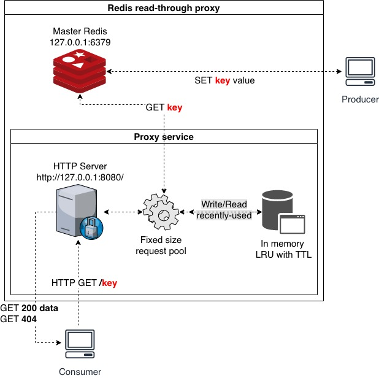

# Redis Proxy

## [Task description](docs/description.pdf)

## Prequisites (tested on)

- bash >= 3.2.57
- docker >= 19.03.8
- docker-compose >= 1.25.5
- make >= 3.81

## System design



## Alogirthms & data structures

- [LRU cache](structs/LRU.js) achieves `O(1)` at best for reading due to the use of HashMap. `LRU cache` achives `O(1)` for writing due to the use of DoubleLinkedList
- [Pool](structs/Pool.js) uses [Queue](structs/Queue.js) with `O(1)` for `push` and `O(1)` for `lpop`
- [Deferred](structs/Deferred.js) is a simple mutex implementation to control `loop` in the pool

## [Installation](./Makefile)

```bash
# Builds docker image
make

# Runs tests
make test

# Runs the service at http://localhost:8080/
make start

# Terminates the service
make stop
```

## Troubleshoot

Running `make test` could result in some tests failing at first. Try `make` before `make test`
